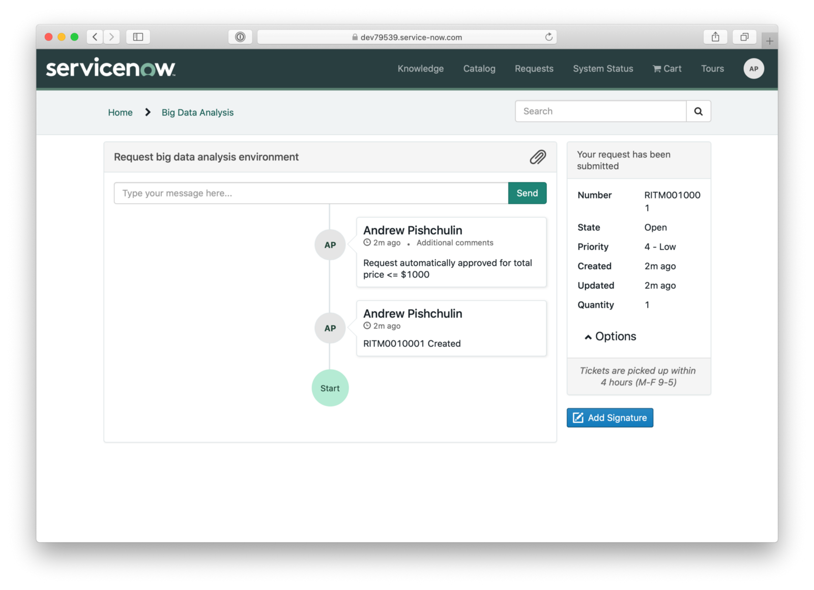
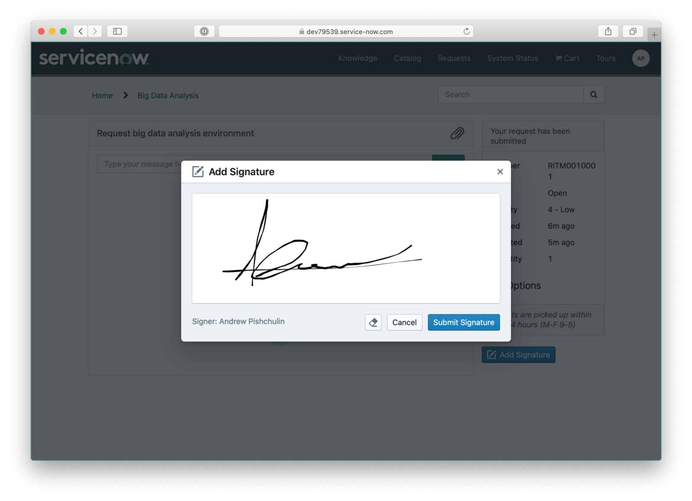
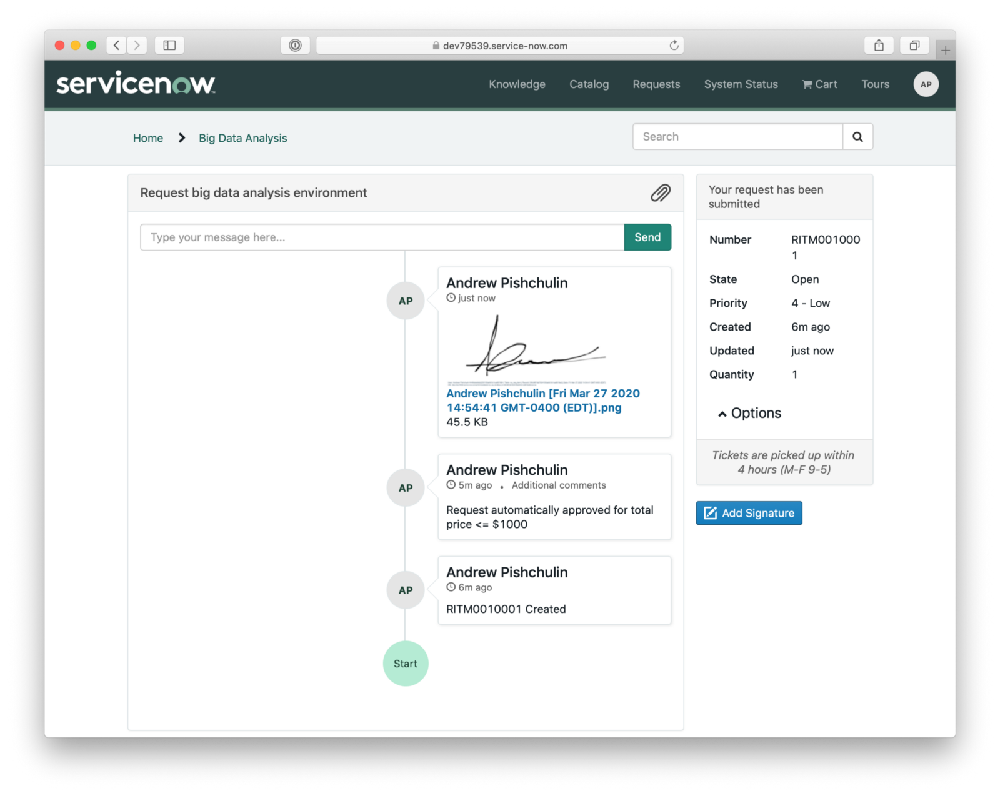
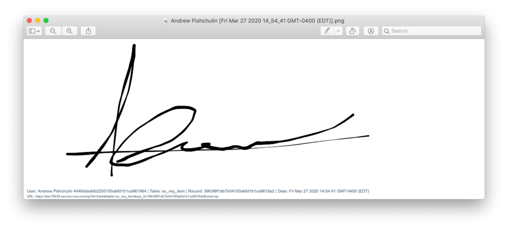
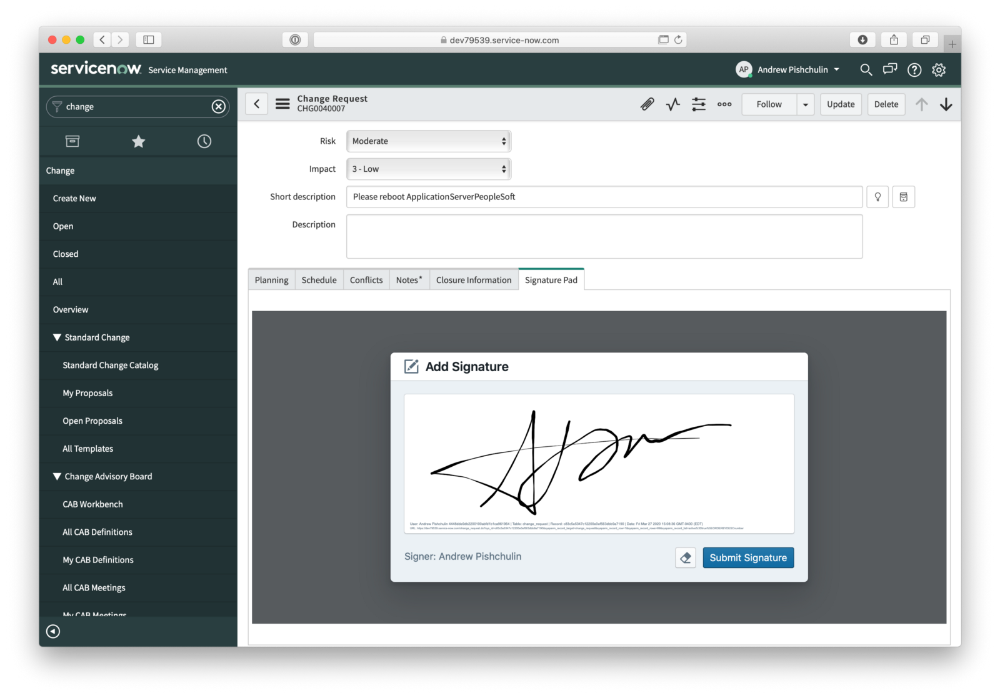

# Service Portal Signature Pad widget

To install the widget you need to do the following:

1. Download an XML update set - **Signature Pad Widget.xml**. You can get the file from this repo or [download](https://s3.amazonaws.com/dev-labs.io/signature-pad/Signature+Pad+Widget.xml) it instantly.
2. Import the update set into your ServiceNow instance: navigate to **System Update Sets > Retrieved Update Sets**, select **Import Update Set from XML**, and upload the XML file.
3. Preview and commit the imported update set.

Once the update set installed, a new Service Portal widget **Signature Pad** will be available and you can use it on any Service Portal page and in custom applications.

Service Portal widget name is "Signature Pad" and a widget ID is `elin-signature-pad-v1`.

## How to use the widget

The widget allows users to capture a signature and instantly save it as an attachment on a current record. 

Current record identified by `table` and `sys_id` parameters from the page URL, so make sure you specify those parameters when loading the page.

When you add a widget to a Service Portal page - you will see "Add Signature" button. If the page does not have table and sys_id defined in URL the button will be disabled.



When a user clicks the button, a signature pad appears and the user can sign and submit the signature: 



Once submitted, the signature with some meta data will be attached to the current record.





## How to use Signature Pad in ServiceNow native UI

1. Create a service portal page `signature_pad` and add Signature Pad widget
2. Create a new service portal `signature_portal`
3. Create a UI macro with the following code:

```html <?xml version="1.0" encoding="utf-8" ?>
<j:jelly trim="false" xmlns:j="jelly:core" xmlns:g="glide" xmlns:j2="null" xmlns:g2="null">
 <iframe src="signature_portal?id=signature_pad" 
   width="100%"
   scrolling="no" 
   style="border:none;min-height:450px;">
 </iframe>
</j:jelly>
```

4. Create Formatters for the tables where you want to use a Signature Pad.
5. Add formatters to the corresponding forms.



## Advanced version and customization

Advanced version of the widget includes the following functionality:

1. Custom styles, appearance and actions
2. Additional metadata
3. PDF support

For more details about the advanced version or if you need a custom widget with a specific functionality - please contact info@elinsoftware.com.